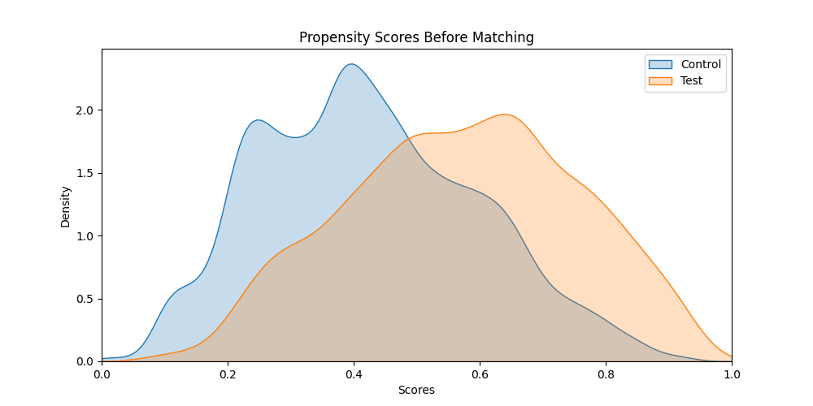
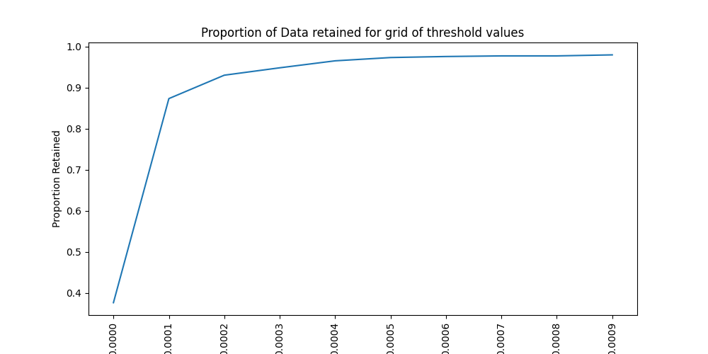

# `pysmatch`

[](https://badge.fury.io/py/pysmatch)
[](https://pepy.tech/project/pysmatch)

[](https://codecov.io/github/miaohancheng/pysmatch)

**PSM（Propensity Score Matching，倾向得分匹配）** 是一种统计方法，用于处理观察性研究中的选择偏差问题，尤其是在评估处理效果时。通过计算处理和未处理组每个观察单元的倾向得分——即在给定观察到的协变量条件下接受处理的条件概率，并基于这些得分来匹配处理组和控制组的个体，使得两组在协变量上更为相似。这种方法能够在非随机化的研究设计中模仿随机化实验的效果，以估计干预的因果效应。

`pysmatch` 是 [`pymatch`](https://github.com/benmiroglio/pymatch) 的改进和扩展版本，为 Python 提供了一个稳健的倾向得分匹配工具。该包修复了原项目中的已知错误，并引入了并行计算和模型选择等新功能，提升了性能和灵活性。

## 多语言文档

[[English](https://github.com/mhcone/pysmatch/blob/main/README.md)|中文]

### **此版本更新与主要特性**

我们对代码结构进行了**模块化重构**（如将功能拆分到 `modeling.py`、`matching.py` 等文件），并对包括 `catboost`、`optuna`、`imblearn` 在内的主要依赖库采用**懒加载**策略。这种设计能有效减少在未使用某些功能时的导入开销和内存占用，大幅提升项目的**性能**与**灵活性**。

此外，我们还新增了与 **Optuna** 的**可选集成**来进行超参数调优：如果希望自动搜索超参，只需在调用 `fit_scores` 时设置 `use_optuna=True` 并指定 `n_trials=<int>`，系统就会运行 **Optuna study** 来寻找最佳模型参数；若仍想保持**原多模型训练方式**，则将 `use_optuna` 保持默认的 `False` 即可。

除此之外，`pysmatch` 还提供：
- **错误修复**：解决了 `pymatch` 原项目中的已知问题。
- **并行计算**：可利用多核 CPU 加速模型训练。
- **灵活的模型选择**：可使用逻辑回归、CatBoost 或 KNN 进行倾向得分估计。

整体而言，这些增强让匹配流程**更整洁、更高效，也更健壮**，能更好地服务于您的观察性研究场景。
## 安装

`pysmatch` 已发布到 PyPI，可以通过 pip 进行安装：

```bash
pip install pysmatch
```

## 快速开始

了解 pysmatch 的最佳方式是通过一个示例。以下指南将引导您使用 pysmatch 对 [Lending Club 贷款数据](https://www.kaggle.com/wendykan/lending-club-loan-data) 进行倾向得分匹配。


您可以跟随本文档，或者下载对应的 [Example.ipynb](https://github.com/mhcone/pysmatch/blob/main/Example.ipynb) 笔记本。


**下载数据集**


要复现此示例，您需要从 Kaggle 下载 loan.csv 数据集：


​	1.	如果您还没有 Kaggle 账户，请免费注册一个。

​	2.	访问 [Lending Club 贷款数据](https://www.kaggle.com/wendykan/lending-club-loan-data) 页面。

​	3.	下载 loan.csv 文件。


**注意**：请确保将数据集放在与您的脚本相同的目录，或相应地更新文件路径。


**示例**


在此示例中，我们旨在根据可观察的特征，将完全偿还贷款的 Lending Club 用户（对照组）与违约的用户（测试组）进行匹配。这使我们能够在控制混杂变量的情况下，分析违约对用户情绪等变量的因果影响。

 **目录**


​	•	[数据准备](#数据准备)

​	•	[拟合倾向得分模型](#拟合倾向得分模型)

​	•	[预测倾向得分](#预测倾向得分)

​	•	[调整匹配阈值](#调整匹配阈值)

​	•	[匹配数据](#匹配数据)

​	•	[评估匹配质量](#评估匹配质量)

​	•	[结论](#结论)

​	•	[附加资源](#附加资源)

​	•	[贡献](#贡献)

​	•	[许可证](#许可证)

----

## **数据准备**


首先，我们导入必要的库，并抑制任何警告以获得更清晰的输出。


```python
import warnings
warnings.filterwarnings('ignore')

import pandas as pd
import numpy as np
from pysmatch.Matcher import Matcher

%matplotlib inline
```

接下来，我们加载数据集，并选择与我们分析相关的列。

Load the dataset (`loan.csv`) and select a subset of columns.

```python
# Define the file path and the fields to load
path = "loan.csv"
fields = [
    "loan_amnt",
    "funded_amnt",
    "funded_amnt_inv",
    "term",
    "int_rate",
    "installment",
    "grade",
    "sub_grade",
    "loan_status"
]

# Load the data
data = pd.read_csv(path, usecols=fields)
```

**了解变量**


​	•	**loan_amnt**：借款人申请的贷款金额。

​	•	**funded_amnt**：截至目前承诺给该贷款的总金额。

​	•	**funded_amnt_inv**：投资者为该贷款提供的总金额。

​	•	**term**：贷款的付款期数（以月为单位）。

​	•	**int_rate**：贷款的利率。

​	•	**installment**：借款人每月应付的还款额。

​	•	**grade**：Lending Club 分配的贷款等级。

​	•	**sub_grade**：Lending Club 分配的贷款子等级。

​	•	**loan_status**：贷款的当前状态。


**创建测试组和对照组**


我们创建两个组：


​	•	**测试组**：违约的用户。

​	•	**对照组**：完全偿还贷款的用户。


然后，我们将 loan_status 编码为二元处理指标。

```python
# Create test group (defaulted loans)
test = data[data.loan_status == "Default"].copy()
test['loan_status'] = 1  # Treatment group indicator

# Create control group (fully paid loans)
control = data[data.loan_status == "Fully Paid"].copy()
control['loan_status'] = 0  # Control group indicator
```


----

## **拟合倾向得分模型**


我们初始化 Matcher 对象，指定结果变量（yvar）以及要从模型中排除的变量（例如，唯一标识符）。
```python
# Initialize the Matcher
m = Matcher(test, control, yvar="loan_status", exclude=[])
```

输出:

```python
Formula:
loan_status ~ loan_amnt + funded_amnt + funded_amnt_inv + term + int_rate + installment + grade + sub_grade
n majority: 207723
n minority: 1219
```
## **处理类别不平衡**


我们的数据存在显著的类别不平衡，对照组（完全偿还贷款）数量远超测试组（违约贷款）。为了解决这个问题，我们在拟合倾向得分模型时设置 balance=True，这告诉 pysmatch 对多数类进行欠采样，以创建平衡的数据集用于模型训练。

我们还指定 nmodels=100 来在不同的随机样本上训练 100 个模型，确保多数类的更多部分参与模型训练。


## **模型选择与并行计算**

在 pysmatch 中，您可以使用以下多种模型来估计倾向得分：
•	**线性模型**（逻辑回归）
•	**树模型**（如 CatBoost）
•	**K 近邻** (KNN)

此外，还支持并行计算：通过指定 n_jobs 参数，可以利用多核 CPU 来加速模型训练。下面的示例演示了传统的多模型训练方式以及基于 Optuna 的超参数调优：
```python
# Set random seed for reproducibility
np.random.seed(42)

# ============ (1) Noraml train (Without optuna) =============
# m.fit_scores(balance=True, nmodels=10, n_jobs=3, model_type='knn')
# m.fit_scores(balance=True, nmodels=10, n_jobs=3, model_type='tree', max_iter=100)
m.fit_scores(balance=True, nmodels=10, n_jobs=3, model_type='linear', max_iter=200)

# ============ (2) Utilize optuna (Only train one best model) =============
# m.fit_scores(
#     balance=True,
#     model_type='tree',
#     max_iter=200,
#     use_optuna=True,
#     n_trials=15
# )
```

输出:

```python
Fitting 100 Models on Balanced Samples...
Average Accuracy: 70.21%
```

**注意**：平均准确率表明了在给定观察到的特征下类别的可分性。显著高于 50% 的准确率表明匹配是合适的。


## **预测倾向得分**


拟合模型后，我们为数据集中的所有观察值预测倾向得分。
```python
# Predict propensity scores
m.predict_scores()
```

我们可以可视化测试组和对照组的倾向得分分布。
```python
# Plot propensity score distributions
m.plot_scores()
```





**解读**:图表显示测试组（违约贷款）通常具有较高的倾向得分，表明模型可以根据观察到的特征区分两个组。

---

## **调整匹配阈值**

匹配阈值决定了两个倾向得分被认为匹配所需的相似程度。较小的阈值会产生更接近的匹配，但可能会减少匹配对的数量。

我们使用 tune_threshold 方法找到一个平衡匹配质量和样本量的合适阈值。

```python
m.tune_threshold(method='random')
```




根据图表，阈值为 0.0001 时保留了测试组的 100%。我们将使用此阈值进行匹配。

---

## **匹配数据**


我们改进了匹配方法，增加了一个选项来控制匹配过程中是否允许有放回匹配。您可以指定匹配方法、每个观察的匹配数、阈值，以及是否允许在匹配过程中有放回。

```python
# Perform matching
m.match(method="min", nmatches=1, threshold=0.0001, replacement=False)
```
此命令将使用最小差异策略执行匹配过程，确保1:1无放回匹配。阈值设置用于确定倾向得分需要多接近才能考虑为适当的匹配。

**理解匹配参数**


​	•	**method**:

​	•	"min"：根据倾向得分差的最小值找到最接近的匹配。

​	•   "random"：在阈值内随机选择匹配。

​	•	**nmatches**: 为测试组中的每个观察值找到的匹配数量。

​	•	**threshold**: 匹配对之间允许的倾向得分最大差值。

​	•   **replacement**: 在匹配过程中是否允许有放回匹配。

## **处理多重匹配**


允许重复匹配意味着一个对照组观察值可以匹配多个测试组观察值。我们可以评估在匹配数据集中对照组观察值的使用频率。


```python
# Assess record frequency in matches
m.record_frequency()
```

输出:

```python
   freq  n_records
0     1       2264
1     2         68
2     3         10
3     4          2
```

为了在后续分析中考虑这一点，我们根据观察值的频率为其分配权重。
```python
# Assign weights to matched data
m.assign_weight_vector()
```

## **检查匹配数据**

```python
# View a sample of the matched data
m.matched_data.sort_values("match_id").head(6)
```
|   index | record_id | weight | loan_amnt | funded_amnt | funded_amnt_inv | term       | int_rate | installment | grade | sub_grade | loan_status | scores    | match_id |
|--------:|----------:|-------:|----------:|------------:|----------------:|:-----------|---------:|-----------:|:-----:|:--------:|-----------:|----------:|---------:|
|       0 |         0 |    1.0 |   18000.0 |     18000.0 |      17975.0000 | 60 months  |    17.27 |     449.97 |   D   |    D3    |          1 |  0.644783 |        0 |
|    2192 |    191970 |    1.0 |    2275.0 |      2275.0 |       2275.0000 | 36 months  |    16.55 |      80.61 |   D   |    D2    |          0 |  0.644784 |        0 |
|    1488 |     80665 |    1.0 |   18400.0 |     18400.0 |      18250.0000 | 36 months  |    16.29 |     649.53 |   C   |    C4    |          0 |  0.173057 |        1 |
|       1 |         1 |    1.0 |   21250.0 |     21250.0 |      21003.6040 | 60 months  |    14.27 |     497.43 |   C   |    C2    |          1 |  0.173054 |        1 |
|       2 |         2 |    1.0 |    5600.0 |      5600.0 |       5600.0000 | 60 months  |    15.99 |     136.16 |   D   |    D2    |          1 |  0.777273 |        2 |
|    1828 |    153742 |    1.0 |   12000.0 |     12000.0 |      12000.0000 | 60 months  |    18.24 |     306.30 |   D   |    D5    |          0 |  0.777270 |        2 |

	•	record_id：每个观察值的唯一标识符。
	•	weight：匹配数据集中对照组观察值频率的倒数。
	•	match_id：匹配对的标识符。


---

## **评估匹配质量**


匹配后，评估测试组和对照组之间协变量是否平衡至关重要。


**分类变量**


我们使用卡方检验和比例差异图比较匹配前后分类变量的分布。
```python
# Compare categorical variables
categorical_results = m.compare_categorical(return_table=True)
```


**解读**:匹配后的 p 值均高于 0.05，表明我们无法拒绝分布独立于组标签的原假设。比例差异也显著减少。


**连续变量**


对于连续变量，我们使用经验累积分布函数（ECDF）和 Kolmogorov-Smirnov 检验等统计测试。
```python
# Compare continuous variables
continuous_results = m.compare_continuous(return_table=True)
```

**解读**: 匹配后，测试组和对照组的 ECDF 几乎相同，统计测试的 p 值高于 0.05，表明平衡良好。


**结果总结**

```python
# Display categorical results
print(categorical_results)
```

| index | var       | before | after    |
|------:|:---------:|-------:|---------:|
|     0 | term      |    0.0 | 0.433155 |
|     1 | grade     |    0.0 | 0.532530 |
|     2 | sub_grade |    0.0 | 0.986986 |

```python
# Display continuous results
print(continuous_results)
```

| index | var             | ks_before | ks_after | grouped_chisqr_before | grouped_chisqr_after | std_median_diff_before | std_median_diff_after | std_mean_diff_before | std_mean_diff_after |
|------:|:---------------:|----------:|---------:|----------------------:|----------------------:|------------------------:|-----------------------:|----------------------:|---------------------:|
|     0 | loan_amnt       |       0.0 |    0.530 |                 0.000 |                 1.000 |                 0.207814 |               0.067942 |               0.229215 |             0.013929 |
|     1 | funded_amnt     |       0.0 |    0.541 |                 0.000 |                 1.000 |                 0.208364 |               0.067942 |               0.234735 |             0.013929 |
|     2 | funded_amnt_inv |       0.0 |    0.573 |                 0.933 |                 1.000 |                 0.242035 |               0.067961 |               0.244418 |             0.013981 |
|     3 | int_rate        |       0.0 |    0.109 |                 0.000 |                 0.349 |                 0.673904 |               0.091925 |               0.670445 |             0.079891 |
|     4 | installment     |       0.0 |    0.428 |                 0.004 |                 1.000 |                 0.169177 |               0.042140 |               0.157699 |             0.014590 |

## **结论**


使用 pysmatch，我们成功地将违约用户与完全偿还贷款的用户进行了匹配，在所有协变量上实现了平衡。这个平衡的数据集现在可以用于因果推断或进一步分析，例如评估违约对用户情绪的影响。

**注意**: 在实际应用中，可能无法总是实现完美的平衡。在这种情况下，考虑调整匹配参数或包含其他协变量。您还可以在后续分析中控制残留的不平衡。


## **附加资源**


​	•	**Sekhon, J. S.** (2011). *Multivariate and propensity score matching software with automated balance optimization: The Matching package for R*. Journal of Statistical Software, 42(7), 1-52. [Link](https://www.jstatsoft.org/article/view/v042i07)

​	•	**Rosenbaum, P. R., & Rubin, D. B.** (1983). *The central role of the propensity score in observational studies for causal effects*. Biometrika, 70(1), 41-55.  [Link](https://stat.cmu.edu/~ryantibs/journalclub/rosenbaum_1983.pdf)


## **贡献**


我们欢迎社区的贡献。如果您遇到任何问题或有改进建议，请在 GitHub 上提交问题或拉取请求。


**如何贡献**


	1.	Fork 此仓库。
	2.	为您的功能或错误修复创建一个新分支。
	3.	使用清晰的信息提交您的更改。
	4.	向主仓库提交拉取请求。


## **License**


pysmatch 使用 MIT 许可证。


**免责声明**: 此示例中使用的数据仅用于演示目的。请确保您在分析中使用任何数据集时拥有相应的权利和权限。


